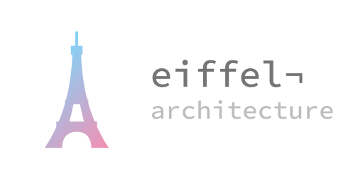
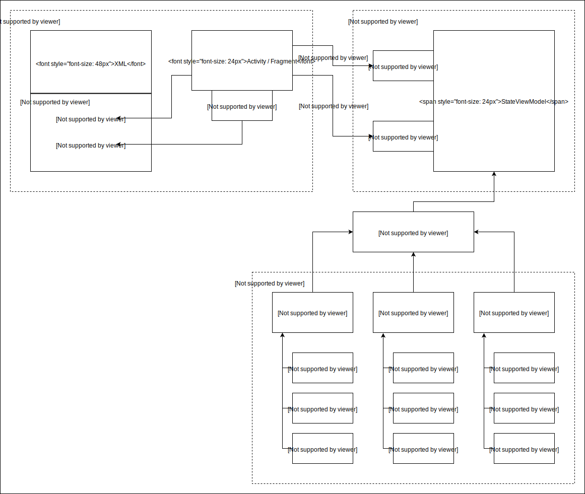

# Eiffel
[](https://www.bitrise.io/app/d982833489004cbc)
[](https://jitpack.io/#etiennelenhart/eiffel)



A light-weight *Kotlin* Android architecture library for handling immutable view states with [Jetpack Architecture Components](https://developer.android.com/jetpack/arch/).

Eiffel provides an extended `ViewModel` class with immutable state handling in conjuction with Delegated Properties for easy referencing in `Activities` and `Fragments`.

For users of Android's [Data Binding](https://developer.android.com/topic/libraries/data-binding/) framework this library adds a specialized `BindingState` to adapt an immutable state for binding and some convenience Delegated Properties for common Data Binding operations.

As a bonus Eiffel offers wrapper classes with convenience functions to represent the status of business logic commands and [`LiveData`](https://developer.android.com/topic/libraries/architecture/livedata.html) values.

Any questions or feedback? Feel free to contact me on Twitter [@etiennelenhart](https://twitter.com/etiennelenhart).

## Contents
* [Installation](#installation)
* [Migration](#migration)
* [Architecture](#architecture)
* [Immutable state](#immutable-state)
* [Basic usage](#basic-usage)
  * [ViewState](#viewstate)
  * [ViewModel](#viewmodel)
  * [Observing](#observing)
* [Advanced usage](#advanced-usage)
  * [ViewEvent](#viewevent)
  * [Dependency injection](#dependency-injection)
  * [Delegated Properties in Fragments](#delegated-properties-in-fragments)
* [Data Binding](#data-binding)
  * [BindingState](#bindingstate)
  * [Delegated Properties for Binding](#delegated-properties-for-binding)
* [Status](#status)
  * [Commands](#commands)
  * [LiveData](#livedata)

## Installation
build.gradle *(project)*
```gradle
repositories {
    maven { url 'https://jitpack.io' }
}
```

build.gradle *(module)*
```gradle
dependencies {
    implementation "androidx.lifecycle:lifecycle-extensions:$lifecycle_version"
    implementation 'com.github.etiennelenhart:eiffel:3.2.0'
}
```

## Migration
Migration guides for breaking changes:
 * [2.0.0 → 3.x.x](./MIGRATION2-3.md)
 * [3.x.x → 4.0.0](./MIGRATION3-4.md)

## Architecture
Eiffel's architecture recommendation is based on Google's [Guide to App Architecture](https://developer.android.com/jetpack/docs/guide) and therefore encourages an MVVM style. An exemplified app architecture that Eiffel facilitates is shown in the following diagram.



## Immutable state
Eiffel encourages the use of an immutable view state, meaning that the `ViewModel` always emits a new fresh state to the observing `Activity` or `Fragment`. The view may then process and display the current state. This minimizes inconsistent UI elements and threading problems.

## Basic usage
### ViewState
Creating a view state is as easy as implementing the `ViewState` interface:
```kotlin
data class CatViewState(val name: String = "") : ViewState
```
Just make sure to use Kotlin's [Data Classes](https://kotlinlang.org/docs/reference/data-classes.html) and provide default values for parameters when possible. This facilitates creation of the initial state in the `ViewModel` and allows you to update the state while keeping it immutable.

### ViewModel
`StateViewModel` inherits from Architecture Components' `ViewModel` and can therefore be used in the same way. Just use it as a base class for your `ViewModel` and provide the type of the associated `ViewState`. It is then required to override the `state` property, which holds the current `ViewState` inside a `LiveData`.
```kotlin
class CatViewModel : StateViewModel<CatViewState>() {
    override val state = MutableLiveData<CatViewState>()
    ...
}
```
Then initialize the `ViewState` when the `ViewModel` is constructed. Just call `initState()` with an instance of the associated `ViewState`. `StateViewModel` provides a `stateInitialized` property to check whether a state has already been initialized. The current `ViewState` is then easily accessible from inside the `ViewModel` in its `currentState` property.
```kotlin
class CatViewModel : StateViewModel<CatViewState>() {
    override val state = MutableLiveData<CatViewState>()

    init {
        initState(CatViewState())
        stateInitialized // true
    }
    ...
}
```
When something changes and the `ViewState` needs to be refreshed, just call `updateState`. It expects a lambda expression that receives the current state and should return a new updated state. Using a Kotlin Data Class for your states gives you the benefit of the `copy` function. This allows you to update the state while still keeping things immutable:
```kotlin
updateState { it.copy(name = "Whiskers") }
```
The ViewModel's state `LiveData` will then notify active observers with the new view state.

#### Delegated Properties
For easier access to ViewModels from an `Activity` Eiffel provides convenience [Delegated Properties](https://kotlinlang.org/docs/reference/delegated-properties.html). So instead of manually storing the `ViewModel` inside a lazy property and supplying a Java `Class`, use the `providedViewModel` delegate:
```kotlin
class CatActivity : AppCompatActivity() {
    private val conventionalViewModel by lazy {
        ViewModelProviders.of(this).get(CatViewModel::class.java)
    }
    private val catViewModel by providedViewModel<CatViewModel>()
    ...
}
```

### Observing
Observing the ViewModel's `ViewState` from an `Activity` is similar to observing a `LiveData`. Simply call `observeState` on the provided `ViewModel` and perform any view updates in the `onChanged` lambda expression:
```kotlin
class CatActivity : AppCompatActivity() {
    private val catViewModel by providedViewModel<CatViewModel>()

    override fun onCreate(savedInstanceState: Bundle?) {
        super.onCreate(savedInstanceState)
        viewModel.observeState(this) { nameTextView.text = it.name }
    }
    ...
}
```

## Advanced usage
### ViewEvent
Sometimes the `ViewState` may contain information that should only be shown once, e.g. in an error dialog or may need to trigger one-off events like a screen change. Since the `ViewState` will be updated quite frequently and `LiveData` also emits its last value when an observer becomes active again, these events would be triggered multiple times.

One solution would be to call a `ViewModel` function from the `Activity` that resets the triggering information in the `ViewState` to a default value and ignoring this value in the view's `onChanged` logic. While this will work for smaller projects, Eiffel provides a handy `ViewEvent`.

It should be used as a `ViewState` property which may be set to the current event. For default values, it provides a `ViewEvent.None` object to indicate that there is no event to be handled. When creating ViewEvents consider using Kotlin's [Sealed Classes](https://kotlinlang.org/docs/reference/sealed-classes.html) to constrain possible events and allow easy processing in [When Expressions](https://kotlinlang.org/docs/reference/control-flow.html#when-expression):
```kotlin
sealed class CatViewEvent : ViewEvent() {
    class Meow : CatViewEvent()
    class Sleep : CatViewEvent()
}
```
The `ViewEvent` can then be added to a `ViewState` as a property:
```kotlin
data class CatViewState(val name: String = "", val event: ViewEvent = ViewEvent.None) : ViewState
```
Now, when the `ViewModel` needs to trigger a specific event, just set the state's property to the corresponding `ViewEvent` inside `updateState`:
```kotlin
updateState { it.copy(event = CatViewEvent.Meow()) }
```
The only violation of an immutable state that Eiffel permits is to mark a `ViewEvent` as "handled". Since these are one-off events, the possibility of inconsistent UI elements is low and the benefit of keeping the ViewModel's public functions lean prevails.

To process and handle an event from an `Activity` you can use a when expression in the `onChanged` lambda expression:
```kotlin
viewModel.observeState(this) {
    ...
    when (val event = it.event) {
       is CatViewEvent.Meow -> event.handle { // show Meow! dialog }
       is CatViewEvent.Sleep -> event.handle { // finish Activity }
    }
}
```

### Dependency injection
Dependency injection (DI) is a pattern to decouple objects from their dependencies. It basically means solely working with interfaces and passing every type a specific class depends on in its constructor or functions. This effectively bans the use of "new" or static functions to instantiate these dependencies from inside the class and allows easy swapping with Mocks or Fake classes in Unit Tests. If you have never heard of Dependency injection definitely consider reading up on it. DI should be a fundamental part of a robust and modern app architecture.

There are many ways to implement Dependency injection in your project. Two that Eiffel recommends are using Dagger 2 as a DI framework or Architecture Components' [`ViewModelProvider.Factory`](https://developer.android.com/reference/android/arch/lifecycle/ViewModelProvider.Factory.html). Since Dagger involves a relatively high learning curve only the provider factories will be shown here. If you're not familiar with Dagger but consider using it you may start at the official [Dagger User's Guide](https://google.github.io/dagger/users-guide).

#### Provider factory
At the moment of writing this readme the documentation on `ViewModelProvider` factories is sparse. Using them is actually pretty straightforward though. You basically just need to create a subclass of the `ViewModelProvider.NewInstanceFactory` class. Instances of this class will be used by the framework when retrieving a `ViewModel` from a `ViewModelProvider`.

So start by creating a factory for a `ViewModel` that requires additional dependencies. Let's say the `CatViewModel` shown in the [ViewModel section](#viewmodel) now needs some cat food:
```kotlin
class CatViewModel(private val food: CatFood) : StateViewModel<CatViewState>() { ... }

class CatFactory : ViewModelProvider.NewInstanceFactory() {
    @Suppress("UNCHECKED_CAST")
    override fun <T : ViewModel?> create(modelClass: Class<T>): T {
        return CatViewModel(DryFood()) as T
    }
}
```
Now when getting an instance of the `ViewModel` in an `Activity` you can supply the corresponding factory to the `ViewModelProvider`. Since Activities are instantiated by the system and therefore don't support direct injection, the easiest way to supply an `Activity` with a factory is to provide it as a property in a custom `Application` class the `Activity` has access to. To prevent excessive memory use you can implement a [custom getter](https://kotlinlang.org/docs/reference/properties.html#getters-and-setters) that creates a factory instance on demand:
```kotlin
class FriendlyMittens : Application() {
    val catFactory: ViewModelProvider.NewInstanceFactory
        get() = CatFactory()
    ...
}
```
If you have to keep any dependencies in memory independent of a `ViewModel` lifespan you may leverage Kotlin's [Lazy properties](https://kotlinlang.org/docs/reference/delegated-properties.html#lazy) inside factories or for the factory itself. Similarly, global dependencies required by multiple factories may of course be stored in a property of the custom `Application` and injected in the facrories' constructors.

Eiffel provides overloads for its [Delegated Properties](#delegated-properties) to make getting a `ViewModel` with a custom factory a bit more concise:
```kotlin
class CatActivity : AppCompatActivity() {
    private val catViewModel by providedViewModel<CatViewModel> {
        (application as FriendlyMittens).catFactory
    }
    ...
}
```
The factory is provided in a lambda expression since the `application` property may be `null` before the Activity's `onCreate` method has been called.

### Delegated Properties in Fragments
Analog to the `ViewModel` [Delegated Properties](#delegated-properties) for an `Activity` Eiffel provides delegates for use in a `Fragment`. Getting a Fragment's corresponding `ViewModel` works just like in an `Activity`:
```kotlin
class KittenFragment : Fragment() {
    private val kittenViewModel by providedViewModel<KittenViewModel>()
    private val boredKittenViewModel by providedViewModel<BoredKittenViewModel> {
        (application as FriendlyMittens).boredKittenFactory
    }
    ...
}
```
A propably more common case though is to share an Activity's `ViewModel` across multiple Fragments (see the [ViewModel documentation](https://developer.android.com/topic/libraries/architecture/viewmodel.html#sharing) for more info). Eiffel contains a special Delegated Property to facilitate the use of these shared ViewModels even with custom factories:
```kotlin
class KittenFragment : Fragment() {
    private val catViewModel by sharedViewModel<CatViewModel> {
        (application as FriendlyMittens).catFactory
    }
    ...
}
```
> Internally the delegate supplies the `ViewModelProvider` with the Fragment's associated `Activity` by using its `activity` property. This keeps the `ViewModel` scoped to this `Activity` and all Fragments receive the same instance.

## Data Binding
If you want to use Android's [Data Binding](https://developer.android.com/topic/libraries/data-binding/) framework in your project, Eiffel's got you covered, too. There would be a couple of issues when using an immutable `ViewState` directly in data bindings. Setting individual properties as variables for a binding would essentially break the notification of any changes once the state has been updated with a new instance. While using the whole state as a variable may work, it will trigger an update to every bound view, even when there is no change in the respective property.

### BindingState
To solve these issues Eiffel contains a simple `BindingState` interface that you can base your binding specific states on. It emposes a single `refresh` function that receives the corresponding `ViewState`. This also allows you to keep your view states pretty generic and agnostic to layout details and resources.

Let's say you're making a view for an angry cat that meows a lot. The `ViewState` can be designed without any knowledge of the view's actual layout. It just needs to provide an indicator whether the cat is currently meowing:
```kotlin
data class AngryCatViewState(val meowing: Boolean = false) : ViewState
```
The `BindingState` can then be constructed as complex or simple as needed by the layout. You may extend the state from `BaseObservable` to notify the binding about changes or use ObservableFields (See the [Data Binding documentation](https://developer.android.com/topic/libraries/data-binding/observability) on Observable Data Objects for more info):
```kotlin
class AngryCatBindingState : BindingState<AngryCatViewState> {
    val soundResId = ObservableInt(0)
    val catResId = ObservableInt(R.drawable.cat)

    override fun refresh(state: AngryCatViewState) {
        soundResId.set(if (state.meowing) R.string.meow else 0)
        catResId.set(if (state.meowing) R.drawable.angry_cat else R.drawable.cat)
    }
}
```
In the `Activity` or `Fragment` the state can then be easily refreshed with a new view state:
```kotlin
class AngryCatActivity : AppCompatActivity() {
    ...
    private val state = AngryCatBindingState()

    override fun onCreate(savedInstanceState: Bundle?) {
        super.onCreate(savedInstanceState)

        viewModel.observeState(this) { state.refresh(it) }
        binding.state = state
    }
}
```
To use the `BindingState` in the layout XML just set it as a variable and bind the views to the respective properties:
```xml
<layout ...>

        <data>
            <variable
                name="viewmodel"
                type="com.fluffycat.friendlymittens.angrycat.viewmodel.AngryCatViewModel"/>

            <variable
                name="state"
                type="com.fluffycat.friendlymittens.angrycat.state.AngryCatBindingState"/>
        </data>

        ...

            <ImageView
                ...
                app:imageResource="@{state.catResId}"/>

            <TextView
                ...
                android:text="@{state.soundResId}"/>

        ...

</layout>
```

### Delegated Properties for Binding
To make working with Data Binding a bit more convenient, Eiffel provides some Delegated Properties. The `notifyBinding` delegate allows you to easily notify a changed value to a binding when extending [`BaseObervable`](https://developer.android.com/topic/libraries/data-binding/observability#observable_objects):
```kotlin
class AngryCatBindingState : BaseObservable(), BindingState<AngryCatViewState> {
    @get:Bindable
    var soundResId by notifyBinding(0, BR.soundResId)
        private set

    @get:Bindable
    var catResId by notifyBinding(R.drawable.cat, BR.catResId)
        private set

    override fun refresh(state: AngryCatViewState) {
        soundResId = if (state.meowing) R.string.meow else 0
        catResId = if (state.meowing) R.drawable.angry_cat else R.drawable.cat
    }
}
```
The `contentView` delegate lazily provides a binding in an `Activity` and simultaneously sets it as the content view:
```kotlin
class AngryCatActivity : AppCompatActivity() {
    private val binding by contentViewBinding<ActivityAngryCatBinding>(R.layout.activity_angry_cat)
    ...
}
```

## Status
### Commands
For your business logic Eiffel encourages a variation of [Clean Architecture's](https://8thlight.com/blog/uncle-bob/2012/08/13/the-clean-architecture.html) Use Cases. In its essence these can be seen as interactions that receive a request and return a result. A simple interface declaration could look like this:
```kotlin
// Example, not contained in Eiffel
interface UseCase {
    fun execute(request: Request): Result
}
```
A class with a single function that receives some parameters and returns something pretty much resembles a basic lambda expression in Kotlin. Therefore Eiffel doesn't come with any predefined interfaces or classes for Use Cases. The documentation may refer to them as "commands" but they may be implemented simply by using lambda expressions.

You could, of course, create a generic interface with type parameters for the request and result part, but why bother? The expression's parameters represent the "request" part. Since there is no need for a specialized interface you can supply a single request instance or every required input separately, whatever makes more sense to you.

Where Eiffel tries to simplify things a bit is in the "result" part. Most of the time a command may return a single entity of data, like a primitive value or an instance of a [Data Class](https://kotlinlang.org/docs/reference/data-classes.html). The crucial point with business logic commands though is that they may be asynchronous and most importantly can just fail to complete successfully.

Eiffel provides wrapper classes to associate a status to a command's result, called `Result` and `LiveResult`. They are implemented as [Sealed Classes](https://kotlinlang.org/docs/reference/sealed-classes.html) to allow processing in [When Expressions](https://kotlinlang.org/docs/reference/control-flow.html#when-expression). `Result` contains `Success` and `Error` variants; `LiveResult` consists of `Pending`, `Success` and `Failure` variants. To make working with these easy there are globally available functions to create results: `succeeded()` and `failed()` for `Result` as well as `pending()`, `success()` and `failure()` for `LiveResult`.

The main difference between `Result` and `LiveResult` is the latter's ability to yield intermediate values like progress updates to the command's caller using the `Pending` variant. A `Result` may also be upgraded to a `LiveResult` using `toLive()`. One possible implementation of this can be achieved by using Kotlin's [Coroutine Channels](https://github.com/Kotlin/kotlinx.coroutines/blob/master/coroutines-guide.md#channels).

Since you'll propably want to inject commands into a `ViewModel` it's recommended to use Kotlin's [Type aliases](https://kotlinlang.org/docs/reference/type-aliases.html) for lambda expressions that represent commands. So instead of specifying the complete type of the expression, which may get clunky especially with multiple parameters, just supply the Type alias.

Let's say you want to persist the number of times an angry cat has meowed already. First create Type aliases that specify the required inputs and the type of result:
```kotlin
typealias MeowCount = () -> Result<Int>
typealias PersistMeowCount = (count: Int) -> Result<Unit>
```
Then add the commands as dependencies in the respective `ViewModel`:
```kotlin
class CatViewModel(
    private val food: CatFood,
    private val meows: MeowCount,
    private val persistMeows: PersistMeowCount
) : StateViewModel<CatViewState>() { ... }
```
Now you'll need to supply implementations of the commands when creating an instance of the `ViewModel` in the corresponding `ViewModelProvider.Factory` (Refer to the [Dependency injection](#dependency-injection) section for more info):
```kotlin
class CatFactory : ViewModelProvider.NewInstanceFactory() {
    @Suppress("UNCHECKED_CAST")
    override fun <T : ViewModel?> create(modelClass: Class<T>): T {
        return CatViewModel(
            food = DryFood(),
            meows = {
                val count = // get count from SharedPreferences
                if (/* succeeded */) {
                    succeeded(count)
                } else {
                    failed(/* optional ErrorType */)
                }
            },
            persistMeows = { count: Int ->
                // persist count in SharedPreferences
                if (/* succeeded */) {
                    succeeded()
                } else {
                    failed(/* optional ErrorType */)
                }
            }
        ) as T
    }
}
```
In the `ViewModel` the commands can then be used like any other lambda expression. Eiffel provides extension functions to react to a result depending on its status:
```kotlin
class CatViewModel(
    private val food: CatFood,
    private val meows: MeowCount,
    private val persistMeows: PersistMeowCount
) : StateViewModel<CatViewState>() {
    ...

    init {
        val meowCount = meows().fold({ it }, { -1 })
        ...
    }

    fun persistCount() {
        persistMeows(/* count */).isError { /* Process error */ }
    }
}
```
If you want to supply an `ErrorType` just create an implementation of the `ErrorType` interface as a Sealed Class and use it as a parameter for `failed()`:
```kotlin
sealed class SharedPreferencesError : ErrorType {
    object : ValueNotFound : SharedPreferencesError()
    ...
}

...
    if (/* succeeded */) succeeded() else failed(SharedPreferencesError.ValueNotFound)
...
```

#### Exceptions
Sometimes it is not possible to provide all expected error types ahead of time, especially when calling platform or third party methods. Eiffel provides a handy `attempt()` function that wraps a given expression with a try catch block and automatically converts the outcome to a `Result` either containing the expression's result or an AttemptError with the thrown exception:
```kotlin
attempt { throw RuntimeException() }.isError { it /* is AttemptError with RuntimeException */ }
```

#### Result types
Since Eiffel doesn't constrain commands you are completely free in specifying result types. You can even leverage the power of Kotlin's [Coroutines](https://kotlinlang.org/docs/reference/coroutines.html) to create easy to use asynchronous commands. Check below for some examples of possible combinations:
```kotlin
typealias FireAndForget = () -> Unit
typealias ReturnWithStatus = () -> Result<Unit>
typealias ReturnWithData = () -> Result<String>

typealias Async = suspend () -> Unit
typealias ReturnWithStatusAsync = suspend () -> Result<Unit>
typealias ReturnWithDataAsync = suspend () -> Result<String>

typealias ContinuousStatusUpdates = () -> ReceiveChannel<LiveResult<Float, Unit>>
typealias ContinuousStatusUpdatesWithData = () -> ReceiveChannel<LiveResult<Float, String>>
```

#### Processing
To keep the architecture clean your business logic should be modular. Therefore try to keep commands short and make them do one thing well. Basically adhere to the [Single responsibility principle](https://en.wikipedia.org/wiki/Single_responsibility_principle) and compose simple commands to more complex flows when needed. Eiffel provides some extension functions for command results to make this easier.

To chain multiple commands together you may use the `then()` function that expects the next command as a lambda expression. If the previous command was successful, the next one is called with its data. If it failed the error is forwarded without calling the next command:
```kotlin
getMilk().then { fillBowl(it) }.fold({ ... }, { ... })
```
> Note that the `then()` call is not available for `LiveResult` since it would be unclear how to continue from a pending result.

Sometimes it may be required to convert a result to another one with different data or error type. For example in order to simplify the result of a command that gets the current level of a cat's milkbowl to one that signals an empty bowl. This can be achieved by using the `map()` function which applies the given lambda expression to a command's result data:
```kotlin
getMilkLevel("Whiskers").map { it == 0 }.isSuccess { empty ->
    val name = if (empty) "Hungry Whiskers" else "Happy Whiskers"
    updateState { it.copy(name = name) }
}
```
Similarly, to transform a result's error type to another domain use the `mapError()` or `mapFailure()` function:
```kotlin
getMilkLevel("Whiskers").mapError {
    when (it) {
        MilkLevelError.CatNotFound -> MilkError.UnknownCat
        ...
    }
}.fold ({ ... }, { it /* is from MilkError domain */ })
```
Similarly, to map a pending value from `LiveResult` you may use `mapPending()`.

### LiveData
Continuously updated information that observers may subscribe to like Architecture Components' [`LiveData`](https://developer.android.com/topic/libraries/architecture/livedata.html) can also benefit from an associated status. It even gets briefly mentioned in Android Developers' [Guide to App Architecture]([`LiveData`](https://developer.android.com/jetpack/docs/guide#addendum)). Eiffel contains a simple `Resource` Sealed Class that essentially works just like `LiveResult` does for commands. Just wrap the LiveData's value type with a `Resource` and internally update the value with one of its variants by using one of the available functions:
```kotlin
class CatMilkLiveData : LiveData<Resource<MilkStatus>>() {
    ...

    fun statusChanged() {
        ...
        value = pendingValue(MilkStatus.FILLING)
        ...
        value = successValue(MilkStatus.FULL)
        ...
        value = failureValue(MilkStatus.EMPTY, MilkError.Spilled)        
    }
}
```
To process a `LiveData` resource value you may use the provided extension functions `fold()`, `isSuccess()`, `isPending()` and `isFailure()`. Incorporating the value into the view state can then be accomplished with a [`MediatorLiveData`](https://developer.android.com/topic/libraries/architecture/livedata.html#merge_livedata):
```kotlin
class CatViewModel(..., private val milkStatus: CatMilkLiveData) : StateViewModel<CatViewState>() {
    override val state = MediatorLiveData<CatViewState>()

    init {
        if (!stateInitialized) {
            initState(CatViewState())

            state.addSource(milkStatus, { resource ->
                resource?.isSuccess {
                    val name = if (it == MilkStatus.FULL) "Happy Whiskers" else "Hungry Whiskers"
                    updateState { it.copy(name = name) }
                }
            })
        }
    }

    ...
}
```
